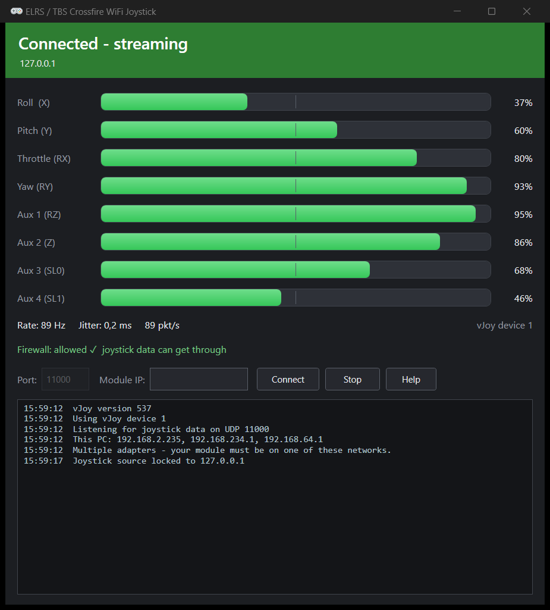

# ExpressLRS / TBS Crossfire WiFi Joystick for Windows

<div align="center">

**Use your ExpressLRS or TBS Crossfire/Tracer radio as a wireless joystick on Windows — with a live visual app**

[](https://dotnet.microsoft.com/download/dotnet/6.0)
[](https://www.microsoft.com/windows)
[](LICENSE)



</div>

This app turns your **ExpressLRS (ELRS)** *or* **TBS Crossfire / Tracer** TX module's WiFi output into a virtual joystick (via vJoy), so you can fly flight simulators like VelociDrone, Liftoff, or DRL — **wirelessly, no cables** — plus anything on Windows that takes joystick input.

Both radios use the same "WiFi joystick" protocol (the one VelociDrone Mobile speaks), so setup is identical: put the module on your WiFi and run the app. The only difference is the discovery beacon — ELRS announces itself as `ELRS`, Crossfire as `VELOCIDRONE` — and the app handles both automatically.

> **v3.0** is a ground-up WPF interface: vector-rendered, so it is pixel-perfect on **any** display scale (100/125/150/200%), with GPU-composited live axis bars, packet rate + jitter, connection status, and one-click firewall setup. It still auto-discovers your module and just works.

## ✨ Features

- 🎮 **Virtual joystick** - creates a Windows vJoy device from your radio's WiFi output
- 📡 **ELRS + Crossfire/Tracer** - full support for the ELRS/Crossfire WiFi joystick protocol (16 channels, 15-bit)
- 🖥️ **Live visual app (WPF)** - real-time GPU-composited axis bars, packet **rate + jitter**, and connection status at a glance
- 🌐 **Auto-discovery** - detects and activates ELRS *and* TBS Crossfire/Tracer modules automatically (or type the IP)
- 🛡️ **One-click firewall** - detects and adds the required Windows Firewall rule for you (the #1 "no data" cause)
- 🔒 **Single-source lock** - if two modules are on the network, only one drives the joystick; pick a specific one by IP
- 📉 **Accurate metrics** - high-resolution jitter/rate measurement
- ❓ **Built-in Help** - a Help button with short tutorials for every feature
- 🪶 **Light & CPU-friendly** - minimize to the system tray to pause the on-screen bars and drop CPU to ~1% (the joystick keeps working); single-instance
- 📦 **No install** - self-contained single-file `.exe`, runs on Windows 7 SP1 through Windows 11 (64-bit)
- ⌨️ **CLI edition too** - `ELRSWifiJoystickCli.exe` (~9 MB, instant start): the same engine and features in a console app - live channel readout, stats, firewall handling, `--tx`, all of it
- 🖥️ **DPI-perfect** - WPF vector rendering: crisp on every display scale (100/125/150/200%), including per-monitor DPI

## 🚀 Quick Start

### Option 1: Download Pre-built Release (Recommended)

1. **Download** the latest release from the [Releases page](../../releases)
2. **Install vJoy** from [vjoystick.sourceforge.net](http://vjoystick.sourceforge.net/)
3. **Extract** the ZIP file and run `ELRSWifiJoystick.exe`
4. **Connect** your ELRS TX module to WiFi

> **Note**: The release package includes everything needed - no .NET installation required!

### Option 2: Build from Source

#### Prerequisites

- **vJoy Driver** - Download from [vjoystick.sourceforge.net](http://vjoystick.sourceforge.net/)
- **.NET 6.0 SDK** - Download from [dotnet.microsoft.com](https://dotnet.microsoft.com/download/dotnet/6.0)

#### Build Steps

1. **Clone** this repository

2. **Setup vJoy Libraries**
   - Install vJoy from the official website
   - Copy `vJoyInterfaceWrap.dll` from `C:\Program Files\vJoy\x64\` to the `lib\` folder

3. **Build the Application**
   
   **Option A: Using Build Scripts (Recommended)**
   ```bash
   # Development build (multiple files, good for testing)
   .\build.bat
   
   # Production build (single executable, good for distribution)
   .\publish.bat
   ```
   
   **Option B: Manual Commands**
   ```bash
   # Development build
   dotnet build -c Release
   
   # Production build (single executable)
   dotnet publish -c Release -r win-x64 --self-contained true -p:PublishSingleFile=true
   ```

### Build Scripts Explained

| Script | Purpose | Output | Use Case |
|--------|---------|--------|----------|
| `build.bat` | Development build | Multiple files (DLLs, runtime, etc.) | Testing, debugging, development |
| `publish.bat` | Production build (GUI) | Single executable + ZIP distribution | Distribution, deployment |
| `publish-cli.bat` | Production build (CLI) | Trimmed ~9 MB console exe + ZIP | Lightweight/headless use |

**build.bat** creates a development build with separate files, making it easier to debug and modify.  
**publish.bat** creates a single-file executable perfect for distribution to end users.

### Running the Tests

The engine and the view model have a full xUnit test suite (`ELRSWifiJoystick.Tests/`)
covering the protocol (beacons, channel frames, malformed packets), the source-lock state
machine, activation throttling, rate/jitter math, socket-level lifecycle (restart,
port-in-use, clean shutdown), and the UI state mapping (banner, axis bars, log capping).
Tests inject a fake clock/output/activator, so they need neither vJoy nor a module:

```bash
dotnet test ELRSWifiJoystick.Tests -c Release
```

## 🔧 Configuration

### vJoy Setup

1. Install vJoy from [vjoystick.sourceforge.net](http://vjoystick.sourceforge.net/)

### ExpressLRS TX Module Setup

1. **Connect to WiFi**:
   - Put your ELRS TX module in WiFi mode
   - Connect to the TX module's WiFi access point OR connect it to your local WiFi network

2. **Access Web Interface**:
   - Open `http://10.0.0.1` or `http://elrs_tx.local` in your browser
   - ELRS should automaticaly send data for WIFI gamepad if connected

### TBS Crossfire / Tracer Setup

Setup is the same as ELRS — the module just needs to be on the same WiFi network. This
uses the "Velocidrone Mobile" support built into the TBS WiFi module (WiFi-module firmware
**v2.17 or later**). **Recommended: WiFi-module firmware v2.25.49mb** — the most stable
build for the Crossfire WiFi joystick. (Any v2.17+ works; the app was also verified
against v3.10.)

1. **Connect to WiFi**:
   - Enable WiFi on the Crossfire/Tracer TX (WiFi module powered).
   - Either connect the module to your local WiFi network (recommended), or connect your PC
     to the module's own access point (`tbs_crossfire_XXXXXXXXXXXX` / `192.168.4.1`).
   - Your PC and the module must be on the same network.

2. **Run the app** — no extra configuration needed:
   - The module continuously broadcasts a `VELOCIDRONE` discovery beacon (~every 8 s). The
     app detects it and automatically sends the activation request, then starts receiving
     channel data.
   - To skip the beacon wait and activate instantly, pass the module's IP:
     `ELRSWifiJoystick.exe --tx 192.168.2.138`
     (find the IP on the module's WiFi web page).

> **How it works:** the app POSTs `action=joystick_begin` to the module's `/udpcontrol`
> endpoint — the same request ELRS uses — and the module streams RC channels over UDP on
> port 11000. No radio-to-FC wiring, MAVLink, or ground-control software is involved; the
> WiFi module sends stick data directly.

## 🎮 Usage

1. **Run `ELRSWifiJoystick.exe`.** The app opens, initializes vJoy, and starts listening
   automatically. The first time, accept the one-time Windows permission (UAC) prompt so the
   firewall lets the joystick data through.

2. **Watch the status banner:**
   - 🟠 *Searching for module…* — make sure your module is on the same WiFi.
   - 🟢 *Connected — streaming* — the axis bars move with your sticks, and you'll see the
     packet **rate** and **jitter**.

3. **Use in your flight simulator:** open VelociDrone / Liftoff / DRL etc., select
   **"vJoy Device"** as the controller, and calibrate the axes.

4. **Optional controls:**
   - **Module IP** — leave blank for auto-discovery, or type your module's IP and press
     **Connect** to target a specific module (skips the beacon wait; find the IP on the
     module's WiFi web page).
   - **Port** — the UDP port (default `11000`); change it while stopped.
   - **Fix Firewall** — appears only if the firewall is blocking data.
   - **Help** — opens short tutorials for every feature.
   - Minimizing to the tray pauses the on-screen bars and drops CPU to ~1% — the joystick
     keeps working, so **minimize while flying** for best performance.
   - Closing the window centers the vJoy axes and releases the device.

**Command-line (optional):** `ELRSWifiJoystick.exe [port] [--tx <module-ip>]` — e.g.
`ELRSWifiJoystick.exe --tx 192.168.2.138` pre-fills the module IP on launch.

> **Stopping the module's stream:** the ELRS/Crossfire WiFi module has **no remote stop
> command** — once activated it keeps broadcasting channel data until it is powered off,
> rebooted, or its WiFi drops. Closing this app only stops *reading* the stream; it does not
> (and cannot) stop the module from sending. This is a module-firmware behaviour, not an app
> limitation.

## 📋 Channel Mapping

The application maps ExpressLRS channels to vJoy axes:

| ExpressLRS Channel | vJoy Axis | Description |
|-------------------|-----------|-------------|
| 0 (Roll)          | X         | Aileron/Roll control |
| 1 (Pitch)         | Y         | Elevator/Pitch control |
| 2 (Throttle)      | RX        | Throttle control |
| 3 (Yaw)           | RY        | Rudder/Yaw control |
| 4                 | RZ        | Auxiliary control |
| 5                 | Z         | Auxiliary control |
| 6                 | Slider 0  | Auxiliary control |
| 7                 | Slider 1  | Auxiliary control |

**Note:** Values are passed directly from the module (15-bit range: 0-32767) to vJoy without scaling or filtering for maximum precision and minimal latency. This applies to both ELRS and Crossfire, which share the same channel encoding.

## 🔧 Troubleshooting

### Common Issues

| Issue | Solution |
|-------|----------|
| "vJoy driver not enabled" | Install vJoy driver and enable device #1 in "Configure vJoy" |
| "vJoy Device 1 is already owned" | Close other applications using vJoy device #1 |
| "Waiting for joystick data..." | Ensure the TX module is connected to WiFi; for Crossfire, wait for the `VELOCIDRONE` beacon or pass `--tx <module-ip>` |
| No joystick input in simulator | Verify vJoy device is enabled and simulator recognizes "vJoy Device" |
| Crossfire not detected | Confirm the module is on the same network (ping its IP); WiFi-module firmware must be **v2.17+**. Try `--tx <ip>` to activate directly |
| Crossfire axes look wrong/half-throw | Channels are passed through as 15-bit like ELRS. If your radio's output differs, recalibrate the axes in the simulator |
| **Connected but no data / axes don't move** | **Windows Firewall is blocking the incoming UDP stream.** The app adds a rule automatically (accept the one-time UAC prompt); if you declined it, click **Fix Firewall** in the app. |

### ⚠️ Most common issue: "activated OK but no data" = Firewall

If the module activates (the app shows it found the module) but the axes never move, the
inbound joystick stream is being dropped by **Windows Firewall**. Activation works because
that's an *outbound* request; the joystick stream is *inbound* UDP, which Windows blocks by
default.

**The app handles this for you:** on first run it detects the missing rule and adds it via a
one-time **Windows permission (UAC) prompt** — just click *Yes*. If you dismissed it, press the
**Fix Firewall** button in the app.

Prefer to do it manually? Run this once in an **Administrator** terminal:
```
netsh advfirewall firewall add rule name="ELRS WiFi Joystick" dir=in action=allow protocol=UDP localport=11000
```
…or *Windows Defender Firewall → Allow an app…* → add `ELRSWifiJoystick.exe` for **both Private and Public**.

### Other network issues

- **Network**: Ensure the PC and the TX module are on the **same** network/subnet. The app
  prints your PC's IPv4 address(es) at startup — the module must be reachable from one of them.
- **Multiple adapters**: VPNs and VMware/Hyper-V virtual adapters can confuse routing. If the
  app lists several IPs, try temporarily disabling unused adapters.
- **Port**: Confirm UDP port 11000 isn't blocked by another firewall/antivirus.
- **WiFi**: Verify the TX module actually joined the network and has an IP (check your router's
  device list). The ESP WiFi module is **2.4 GHz only**.

### vJoy Issues

- **Installation**: Download vJoy from the official website
- **Permissions**: Run as administrator if vJoy access is denied

## 📊 Technical Details

### Protocol Specification
- **Protocol**: ELRS / TBS Crossfire WiFi Joystick Protocol ("Velocidrone Mobile" link)
- **Discovery**: module broadcasts a beacon on UDP 11000 — `ELRS` (ExpressLRS) or
  `VELOCIDRONE` (TBS Crossfire/Tracer). The app detects it and activates the module.
- **Activation**: HTTP `POST http://<module-ip>/udpcontrol` with form body
  `action=joystick_begin&interval=10000&channels=8`. The module replies `ok` and begins
  streaming. (Activation POSTs are throttled to once per 5 s per module.)
- **Transport**: UDP packets on port 11000
- **Packet Format**:
  - Byte 0: Frame type (1 = channels)
  - Byte 1: Channel count (4-16; Crossfire always sends 16)
  - Bytes 2+: Channel data (16-bit little-endian per channel)
- **Value Range**: 0-32767 (15-bit precision)
- **Update Rate**: ~90-100 Hz typical
- **Single-source lock**: the app binds to the first module that streams real channel data
  and ignores any other source until the bound one is silent for 3 s, so two radios on the
  same network can't interfere.

### Performance Characteristics
- **Latency**: < 10ms from TX to vJoy
- **CPU Usage**: Minimal (< 1% on modern systems)
- **Memory**: ~10MB runtime memory usage
- **Network**: ~1KB/s bandwidth usage

### vJoy Integration
- **Library**: vJoyInterfaceWrap.dll for Windows virtual joystick creation
- **Axes**: Supports up to 8 axes per vJoy device
- **Processing**: Direct pass-through of values for minimal latency
- **Filtering**: No smoothing or filtering applied (raw input for precise control)

## 📄 License

This project is licensed under the MIT License - see the [LICENSE](LICENSE) file for details.

## 🤝 Contributing

Contributions are welcome! Please feel free to submit a Pull Request. For major changes, please open an issue first to discuss what you would like to change.


### Reporting Issues

When reporting issues, please include:
- Windows version
- vJoy version
- ELRS firmware version
- Steps to reproduce
- Console output/logs

## 🙏 Acknowledgments

- [ExpressLRS](https://github.com/ExpressLRS/ExpressLRS) - The amazing open-source RC link system
- [vJoy](http://vjoystick.sourceforge.net/) - Virtual joystick driver for Windows
- .NET Community - For the excellent development platform

---

<div align="center">

**Made with ❤️ for the ExpressLRS community**

[⭐ Star this repository](../../stargazers) if you find it helpful!

</div>

